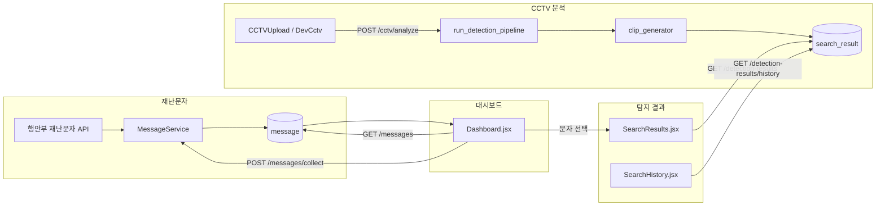

# 실마리 API 연결표

> **목적:** Swagger(`/docs`)만으로는 보이지 않는 **Router → Service/함수 → DB·외부 API → 프론트 화면** 연결을 한눈에 파악하기 위한 문서입니다.  
> **기준일:** 2026-07-08 · OpenAPI 커스터마이즈 적용 후 (`/docs` 경로는 `/api` prefix 없이 표시, 실제 호출은 `/api` + 경로)

---

## 읽는 법

| 열 | 의미 |
|----|------|
| **Docs 경로** | Swagger에 보이는 경로 (`servers: /api` + 이 경로 = 실제 URL) |
| **라우터** | `backend/routers/*.py` |
| **핸들러** | 라우터 함수명 |
| **비즈니스 계층** | Service · Repository · crud · core 모듈 |
| **데이터** | MySQL 테이블 · 파일 · 외부 HTTP API |
| **프론트** | 이 API를 호출하는 화면 (`—` = 미연결·내부용) |

**Swagger 그룹(Tag)** 은 `main.py`의 `OPENAPI_TAGS` 및 각 라우터의 `tags=` 와 일치합니다.

**코드 규칙:** `Router → Service → Repository/crud → Model` — 라우터에 DB·파이프라인 로직을 두지 않습니다.

---

## 제품 API vs 관리 vs 실험 (고정 목록)

| 분류 | prefix | 프론트 | 비고 |
|------|--------|--------|------|
| **제품 핵심** | `/messages`, `/alerts/parse`, `/cctv/analyze`, `/detection-results`, `/auth`, `/users/me`, `/chatbot` | Dashboard, SearchResults, Login… | 신규 기능은 여기 우선 |
| **관리자** | `/admin/*` | `pages/admin/*` | `routers/admin/` 태그별 파일 |
| **실험·내부** | `/search-requests`, `/operations`, `/video` | Dev 페이지만 | 프로덕션 미연결 |

---

## 핵심 제품 흐름 (요약)



---

## 1. System

| Method | Docs 경로 | 라우터 | 핸들러 | 비즈니스 계층 | 데이터 | 프론트 |
|--------|-----------|--------|--------|---------------|--------|--------|
| GET | `/health` | `main.py` | `health_check` | — | — | Dev 헬스체크 |
| GET | `/` | `main.py` | `root` | — | — | — |

> System 엔드포인트는 `/api` 밖에 있습니다. Swagger **Servers**에서 `System` 선택 후 Try it out.

---

## 2. Authentication

| Method | Docs 경로 | 라우터 | 핸들러 | 비즈니스 계층 | 데이터 | 프론트 |
|--------|-----------|--------|--------|---------------|--------|--------|
| POST | `/auth/signup` | `auth.py` | `signup` | ORM 직접 insert | `user` | `Signup.jsx` |
| POST | `/auth/login` | `auth.py` | `login` | `auth_service.authenticate_user` → `create_session_and_tokens` · `record_login_attempt` | `user` · `auth_session` · `login_history` | `Login.jsx` |
| POST | `/auth/refresh` | `auth.py` | `refresh` | `auth_service.refresh_session_tokens` | `auth_session` | `client.js` 인터셉터 |
| POST | `/auth/logout` | `auth.py` | `logout` | `auth_service.revoke_session` | `auth_session` | `useLogout.js` |

### 숨김 (docs 미노출)

| Method | 실제 경로 | 핸들러 | 용도 |
|--------|-----------|--------|------|
| POST | `/api/auth/dev/bootstrap-login` | `dev_bootstrap_login` | 개발용 관리자 JWT 발급 |

---

## 3. Users

| Method | Docs 경로 | 라우터 | 핸들러 | 비즈니스 계층 | 데이터 | 프론트 |
|--------|-----------|--------|--------|---------------|--------|--------|
| GET | `/users/me` | `users.py` | `get_my_profile` | `deps.get_current_user` | `user` | — |

### 숨김

| Method | 실제 경로 | 핸들러 | 비즈니스 계층 | 데이터 |
|--------|-----------|--------|---------------|--------|
| PATCH | `/api/users/me` | `update_my_profile` | `auth_service.change_password` 등 | `user` |

---

## 4. Messages (재난문자)

| Method | Docs 경로 | 라우터 | 핸들러 | 비즈니스 계층 | 데이터 | 프론트 |
|--------|-----------|--------|--------|---------------|--------|--------|
| POST | `/messages/collect` | `messages.py` | `collect_messages` | `MessageService.collect_messages` → `DisasterMessageClient.fetch_messages` → `is_missing_person_message` | 외부 `DISASTER_API_*` → `message` | `Dashboard.jsx` (조회 버튼) · **스케줄러** `collect_messages_job` |
| GET | `/messages` | `messages.py` | `get_list` | `MessageService.get_message_list` → `MessageRepository.find_all` | `message` | **`Dashboard.jsx`** · DevMessagesPage |
| GET | `/messages/{sn}` | `messages.py` | `get_message` | `MessageService.get_message` → `MessageRepository.find_by_sn` | `message` | DevMessagesPage |
| POST | `/messages/manual_input` | `messages.py` | `manual_input` | `MessageService.manual_input_message` → `MessageRepository.insert` | `message` | DevMessagesPage |
| DELETE | `/messages/{sn}` | `messages.py` | `delete_message` | `MessageService.delete_message` → `MessageRepository.delete` | `message` | DevMessagesPage |

**스케줄러:** `backend/core/scheduler.py` → 매일 `MessageService.collect_messages()` 호출 (HTTP 없이 동일 로직).

---

## 5. Alert Parsing

| Method | Docs 경로 | 라우터 | 핸들러 | 비즈니스 계층 | 데이터 | 프론트 |
|--------|-----------|--------|--------|---------------|--------|--------|
| POST | `/alerts/parse` | `alert.py` | `parse_alert` | `run_alert_parse_chain` → `llm.parser.parse_alert_text` | LLM(OpenAI) · DB 없음 | DevAlertPage |

### 숨김

| Method | 실제 경로 | 핸들러 | 비즈니스 계층 |
|--------|-----------|--------|---------------|
| POST | `/api/alerts/receive` | `receive_sms_alert` | `sms_receiver.receive_alert` |

---

## 6. CCTV

| Method | Docs 경로 | 라우터 | 핸들러 | 비즈니스 계층 | 데이터 | 프론트 |
|--------|-----------|--------|--------|---------------|--------|--------|
| POST | `/cctv/analyze` | `cctv.py` | `analyze_video` | **`CctvAnalyzeService.analyze_upload`** → `run_detection_pipeline` → `clip_generator` → `crud.create_search_result` | `search_result` · `data/results/` | DevCctvPage |

> **주의:** `run_detection_pipeline` 은 현재 **스텁**일 수 있음. 실제 비전 로직은 `detect_missing_person_pipeline()` (`core/pipeline.py`). 연결 상태는 `docs/disconnected-code-checklist.md` ISSUE-001 참고.

---

## 7. Detection Results

| Method | Docs 경로 | 라우터 | 핸들러 | 비즈니스 계층 | 데이터 | 프론트 |
|--------|-----------|--------|--------|---------------|--------|--------|
| GET | `/detection-results/history` | `result.py` | `detection_history` | **`DetectionResultService.list_history`** → `crud.get_search_results` | `search_result` | **`SearchHistory.jsx`** |
| GET | `/detection-results` | `result.py` | `search_results` | **`DetectionResultService.list_results`** | `search_result` | **`SearchResults.jsx`** |
| GET | `/detection-results/{id}` | `result.py` | `search_result_detail` | **`DetectionResultService.get_result`** | `search_result` | SearchResults |
| DELETE | `/detection-results/{id}` | `result.py` | `delete_search_result_endpoint` | **`DetectionResultService.delete_result`** | `search_result` + 미디어 | SearchResults |
| DELETE | `/detection-results` | `result.py` | `delete_search_results_endpoint` | **`DetectionResultService.delete_results`** | `search_result` | SearchResults |
| GET | `/detection-results/media/thumbnails/{filename}` | `result.py` | `get_thumbnail` | **`DetectionResultService.resolve_thumbnail_path`** | `data/results/thumbnails/` | SearchResults |
| GET | `/detection-results/media/clips/{filename}` | `result.py` | `get_clip` | **`DetectionResultService.resolve_clip_path`** | `data/results/clips/` | ClipSequencePlayer |

### 숨김

| Method | 실제 경로 | 핸들러 | 용도 |
|--------|-----------|--------|------|
| GET | `/api/detection-results/list` | `list_missing` | 실종자 목록 (sms_receiver) |
| GET | `/api/detection-results/cctv/list/{region_code}` | `list_cctv_by_region` | `cctv_reader.list_cctv_files` |

---

## 8. Chatbot

| Method | Docs 경로 | 라우터 | 핸들러 | 비즈니스 계층 | 데이터 | 프론트 |
|--------|-----------|--------|--------|---------------|--------|--------|
| POST | `/chatbot/chat` | `chatbot.py` | `chat` | `ChatbotService.chat` → LangGraph `build_chatbot_graph` · OpenAI | `chatbot_session` | **`ChatbotPage.jsx`** · DevChatbotPage |

---

## 9. Admin · Members

| Method | Docs 경로 | 핸들러 | 비즈니스 계층 | 데이터 | 프론트 |
|--------|-----------|--------|---------------|--------|--------|
| GET | `/admin/users` | `list_users` | SQLAlchemy `select(User)` | `user` | `MemberViews.jsx` · AdminLayout |
| PATCH | `/admin/users/{id}/approval` | `update_approval` | `audit_service.record_admin_action` | `user` · `admin_history` | `MemberViews.jsx` |

---

## 10. Admin · Audit

| Method | Docs 경로 | 핸들러 | 비즈니스 계층 | 데이터 | 프론트 |
|--------|-----------|--------|---------------|--------|--------|
| GET | `/admin/login-history` | `list_login_history` | SQLAlchemy 쿼리 | `login_history` | `AuditViews.jsx` |
| GET | `/admin/admin-history` | `list_admin_history` | SQLAlchemy 쿼리 | `admin_history` | `AuditViews.jsx` · `DataViews.jsx` |

---

## 11. Admin · Regions

| Method | Docs 경로 | 핸들러 | 비즈니스 계층 | 데이터 | 프론트 |
|--------|-----------|--------|---------------|--------|--------|
| GET | `/admin/regions` | `list_regions` | SQLAlchemy | `region` · `region_legal_dong` | `DataViews.jsx` |
| GET | `/admin/regions/options` | `list_region_options` | SQLAlchemy | `region` | `RegionFormModal.jsx` |
| GET | `/admin/regions/{code}` | `get_region` | SQLAlchemy | `region` | `DataViews.jsx` |
| POST | `/admin/regions` | `create_region` | SQLAlchemy insert | `region` | `DataViews.jsx` |
| PATCH | `/admin/regions/{code}` | `update_region` | SQLAlchemy | `region` | `DataViews.jsx` |
| DELETE | `/admin/regions/{code}` | `delete_region` | SQLAlchemy | `region` | `DataViews.jsx` |
| GET | `/admin/regions/export.csv` | `export_regions_csv` | `region_csv` | `region` | `DataViews.jsx` |
| POST | `/admin/regions/import.csv` | `import_regions_csv` | `region_csv` · `administrative_dong_import` | `region` | `DataViews.jsx` |
| POST | `/admin/regions/clear-all` | `clear_regions_all` | `administrative_dong_import.clear_all_region_data` | `region` · `video.region` 해제 | `DataViews.jsx` |

---

## 12. Admin · Code Groups

| Method | Docs 경로 | 핸들러 | 비즈니스 계층 | 데이터 | 프론트 |
|--------|-----------|--------|---------------|--------|--------|
| GET | `/admin/code-groups` | `list_code_groups` | `code_group_service.build_code_group_list` | `sys_code_group` · `sys_code_item` | `DataViews.jsx` |
| PATCH | `/admin/code-groups/{group_key}` | `update_code_group` | SQLAlchemy | `sys_code_group` | `CodeGroupEditModal.jsx` |
| PATCH | `/admin/code-groups/{group_key}/items/{code}` | `update_code_item` | SQLAlchemy | `sys_code_item` | `CodeGroupEditModal.jsx` |

---

## 13. Admin · Retention

| Method | Docs 경로 | 핸들러 | 비즈니스 계층 | 데이터 | 프론트 |
|--------|-----------|--------|---------------|--------|--------|
| GET | `/admin/retention-policies` | `get_retention_policies` | `retention_service.list_retention_policies` | `retention_policy` | `DataViews.jsx` |
| PATCH | `/admin/retention-policies` | `update_retention_policies` | SQLAlchemy | `retention_policy` | `DataViews.jsx` |
| POST | `/admin/retention-policies/dry-run` | `retention_policies_dry_run` | `retention_service.dry_run_retention` | (시뮬레이션) | `RetentionDryRunModal.jsx` |

---

## 14. Admin · Data Integrity

| Method | Docs 경로 | 핸들러 | 비즈니스 계층 | 데이터 | 프론트 |
|--------|-----------|--------|---------------|--------|--------|
| POST | `/admin/data-integrity/run` | `run_data_integrity` | `region_integrity.run_integrity_suite` · `relational_integrity` · `integrity_audit.record_integrity_run` | `region` · `video` · `message` 등 | `DataViews.jsx` |
| GET | `/admin/data-integrity/last` | `get_last_data_integrity` | `integrity_audit.get_last_integrity_run` | `admin_history` (감사 로그) | `DataViews.jsx` |
| GET | `/admin/data-integrity/runs/{run_id}` | `get_data_integrity_run` | `integrity_audit.get_integrity_run_by_id` | `admin_history` | `DataViews.jsx` |
| GET | `/admin/data-integrity/checks/{id}/issues` | `get_data_integrity_check_issues` | `region_integrity.find_integrity_check` | — | `IntegrityCheckDetailModal.jsx` |
| GET | `/admin/data-integrity/report.csv` | `download_integrity_report_csv` | `run_integrity_suite` 또는 저장 결과 | — | `DataViews.jsx` |

---

## 15. docs에 없는 내부 API

| 실제 경로 | 라우터 | 비즈니스 계층 | 데이터 | 비고 |
|-----------|--------|---------------|--------|------|
| `POST /api/search-requests` | `search.py` | `SearchService` → `SearchRepository` | `search` | DevSearchPage만 |
| `GET /api/search-requests` | `search.py` | 동일 | `search` | 프로덕션 미연결 |
| `GET /api/search-requests/{id}` | `search.py` | 동일 | `search` | — |
| `DELETE /api/search-requests/{id}` | `search.py` | 동일 | `search` | — |
| `GET /api/operations/case-search` | `operations.py` | `require_roles(INVESTIGATOR)` | — | RBAC 데모 |
| `POST /api/video/process` | `video.py` | (주석 처리된 `video_service`) | Chroma 예정 | 미완성 |

---

## 16. DB 테이블 ↔ 도메인 매핑

| 테이블 | 주요 API | 설명 |
|--------|----------|------|
| `user` | `/auth/*`, `/users/me`, `/admin/users` | 회원·RBAC |
| `auth_session` | `/auth/login`, `/auth/refresh`, `/auth/logout` | JWT 세션 |
| `login_history` | `/admin/login-history` | 로그인 감사 |
| `admin_history` | `/admin/admin-history`, 무결성 검사 | 관리자 행동·검사 이력 |
| `message` | `/messages/*` | 재난문자 (대시보드) |
| `search_result` | `/detection-results/*`, `/cctv/analyze` | CCTV 탐지 결과 |
| `search` | `/search-requests/*` | 검색 요청 (별도 도메인) |
| `region` · `region_legal_dong` | `/admin/regions/*` | 행정구역 |
| `sys_code_group` · `sys_code_item` | `/admin/code-groups/*` | 시스템 코드 |
| `retention_policy` | `/admin/retention-policies/*` | 보존 정책 |
| `chatbot_session` | `/chatbot/chat` | 챗봇 대화 상태 |
| `video` · `video_detail` | 스케줄러 `process_videos_job` | 영상 메타 (API 일부 숨김) |

---

## 17. 파일 위치 빠른 참조

```
backend/
├── main.py                 # 라우터 등록 · OpenAPI(/docs) 커스터마이즈
├── routers/                # HTTP 엔드포인트 (팀장님이 보는 1차 진입점)
│   ├── admin/              # 관리자 — Swagger 태그별 파일 분리
│   │   ├── members.py      # Admin · Members
│   │   ├── audit.py        # Admin · Audit
│   │   ├── regions.py      # Admin · Regions
│   │   ├── code_groups.py  # Admin · Code Groups
│   │   ├── retention.py    # Admin · Retention
│   │   └── integrity.py    # Admin · Data Integrity
├── services/               # 비즈니스 로직 · 외부 API 클라이언트
│   ├── detection_result_service.py  # 탐지 결과 조회·삭제
│   ├── cctv_analyze_service.py      # CCTV 분석 오케스트레이션
│   ├── message_service.py
│   └── ...
├── repositories/           # Message · Search DB 접근
├── db/
│   ├── models.py           # ORM 테이블 정의
│   └── crud.py             # SearchResult CRUD
├── core/
│   ├── pipeline.py         # CCTV 탐지 오케스트레이션
│   ├── llm/                # 안내문자 파싱
│   └── scheduler.py        # 재난문자·영상 배치
└── deps.py                 # JWT · RBAC 의존성

frontend/src/
├── api/client.js           # 프로덕션 API 클라이언트
├── pages/Dashboard.jsx     # 재난문자
├── pages/SearchResults.jsx # 탐지 결과
├── pages/admin/            # 관리자 콘솔
└── pages/dev/              # API 테스트 허브
```

---

## 18. 알려진 미연결·주의 사항

| 항목 | 상태 | 참고 |
|------|------|------|
| `run_detection_pipeline` | 스텁 가능 | `disconnected-code-checklist.md` ISSUE-001 |
| `search-requests` | Dev만 사용 | `Search` 테이블 ↔ 프로덕션 UI 미연결 |
| `admin/views/MessageViews.jsx` | 목 UI | `/messages` API 미연결 |
| `video/process` | 주석 처리 | Chroma 인덱싱 미완 |

---

## 갱신 방법

라우터·서비스·프론트 연결을 바꿀 때 이 문서와 `main.py`의 `OPENAPI_TAGS`, 각 라우터의 `summary`/`description`을 함께 업데이트하세요.

```bash
# 엔드포인트 수 확인 (docs 노출분)
python -c "from backend.main import app; print(len(app.openapi()['paths']))"
```
