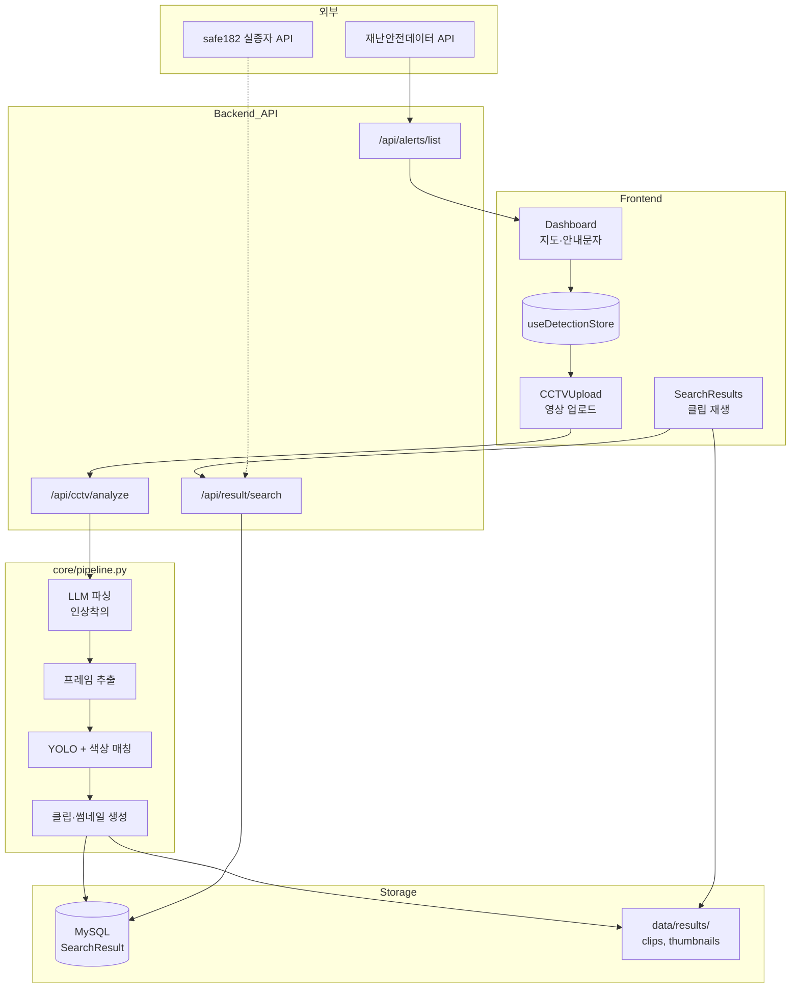

# 실마리(Silmari) 지식틀 — 퍼즐이 맞춰지는 지점

> 발표·학습용 한 장 요약. **"이 프로젝트가 뭘 하는가?"** 는 사용자 여정으로,  
> **"코드는 어떻게 연결되나?"** 는 레이어·파이프라인으로 이해하면 된다.

---

## 1. 머리에 먼저 박을 한 문장

**실종 안내문자(인상착의) + CCTV 영상 → AI가 후보 인물을 찾아 클립으로 보여준다.**

나머지(지도, 재난문자, 회원가입, 관리자)는 전부 이 핵심을 **돕거나 운영하기 위한** 주변 기능이다.

---

## 2. 퍼즐이 맞춰지는 3곳 (여기서 이해가 확 튄다)

### ① 사용자 여정 — "화면이 왜 이렇게 나뉘었나"

```
Landing(소개)
    → Dashboard(지도 + 실종 안내문자 목록)     ← "무엇을 찾을지" 정하는 곳
    → CCTVUpload(문자 + 영상 업로드)          ← "분석 요청" 하는 곳
    → SearchResults(탐지 클립·썸네일)         ← "결과" 보는 곳
```

**연결 고리:** `useDetectionStore` (Zustand)  
Dashboard에서 고른 문자·지역이 → CCTVUpload의 `alertText`, `selectedRegion`으로 → 분석 후 `activeSearch`로 → SearchResults에 전달된다.

| 화면 | 파일 | 하는 일 |
|------|------|---------|
| 대시보드 | `frontend/src/pages/Dashboard.jsx` | 재난문자 API 조회, 지도 필터 |
| CCTV 업로드 | `frontend/src/pages/CCTVUpload.jsx` | `POST /api/cctv/analyze` 호출 |
| 검색 결과 | `frontend/src/pages/SearchResults.jsx` | 클립 재생, DB 이력 조회 |
| 라우팅 | `frontend/src/App.jsx` | 위 화면 경로 정의 |

---

### ② 백엔드 탐지 파이프라인 — "AI가 실제로 뭘 하냐"

**진입점 하나만 기억:** `POST /api/cctv/analyze` → `backend/routes/cctv.py`

```
cctv.py (업로드 저장)
    ↓
pipeline.py (오케스트레이션)          ← ★ 여기가 심장
    ├─ 1단계: llm/chain → parser     안내문자 → {이름, 나이, 의류색, ...}
    ├─ 2단계: frame_extractor        영상 → 5프레임마다 1장
    └─ 3단계: matcher                프레임마다 사람 찾기 + 색상 필터
    ↓
clip_generator.py                    탐지 구간 → MP4 클립 + 썸네일
    ↓
db/crud.py → SearchResult 테이블     검색 이력 저장
```

**matcher 안에서 일어나는 일 (발표 핵심):**

| 순서 | 기술 | 파일 | 역할 |
|------|------|------|------|
| 1 | YOLOv8 | `person_detector.py` | 프레임에서 사람 bbox 탐지 |
| 2 | OpenCV HSV | `person_detector.py` | 안내문자 의류색과 bbox 영역 비교 (20% 미만 탈락) |
| 3 | (예정) 얼굴 | `matcher.py` | 참조 사진 있으면 재식별 보조 |

---

### ③ 레이어 구조 — "폴더가 왜 이렇게 나뉘었나"

```
[브라우저]  frontend/src/
              pages/      화면
              components/ UI 조각
              api/        HTTP 호출
              store/      화면 간 상태

[HTTP]      backend/routes/     URL ↔ 함수 매핑
            backend/deps.py     JWT·역할 검사

[비즈니스]  backend/services/   인증, 파일, 외부 API, 메시지 수집
            backend/core/       설정·보안·★ ML 파이프라인

[데이터]    backend/db/         models, crud, database
            data/               영상, 모델 가중치, 결과 파일
```

**규칙:** `routes`는 얇게, `services`/`core`에 로직, `db`에 저장.

---

## 3. 전체 데이터 흐름 (한 눈에)



---

## 4. 두 갈래 ML — 헷갈리기 쉬운 부분

### A. 실시간 파이프라인 (지금 서비스가 쓰는 것)

`pipeline.py` → YOLO + HSV 색상. **API 한 번 호출로 끝.**

### B. 오프라인 배치 (스크립트·연구용, API와 분리)

```
영상 → frame_extractor (디스크 저장)
     → person_detector (크롭 저장: data/results/detected/)
     → check_same_person.py (OSNet, 동일인 병합 → unique_persons/)
     → crop_embedding.py (FashionCLIP → embeddings/)
     → search_missing_person.py (텍스트 쿼리 vs 이미지 유사도)
```

**발표 때:** "실서비스는 A, 정밀 검색·연구 파이프라인은 B로 확장 중" 이라고 말하면 된다.

---

## 5. 인증·관리자 — 별도 축

탐지와 **독립된** 모듈. 한 번에 안 외워도 됨.

```
회원가입(pending) → admin 승인 → login → JWT
deps.require_roles(INVESTIGATOR) → 역할별 API 보호
```

| 관심 파일 | 역할 |
|-----------|------|
| `backend/routes/auth.py` | 로그인·토큰 |
| `backend/deps.py` | API마다 "누구인지" 검사 |
| `backend/services/auth_service.py` | 세션·토큰 발급 로직 |
| `frontend/.../admin/` | 관리 UI (대부분 목업, 향후 연동) |

---

## 6. 파일 치트시트 — "이거 어디 있지?"

| 궁금한 것 | 가볼 파일 |
|-----------|-----------|
| 앱 전체 시작 | `backend/main.py`, `frontend/src/main.jsx` |
| 환경변수·경로 | `backend/core/config.py`, `.env.example` |
| 탐지 한 번에 보기 | `backend/core/pipeline.py` |
| API 스펙 | http://localhost:8000/docs |
| DB 테이블 | `backend/db/models.py` |
| 프론트↔백 연결 | `frontend/src/api/client.js` |
| 화면 간 상태 | `frontend/src/store/useDetectionStore.js` |

---

## 7. 발표 스토리 순서 (추천)

1. **문제** — 실종 안내문자는 오는데, CCTV는 사람이 일일이 봐야 함  
2. **해결** — 문자에서 인상착의 자동 추출 + CCTV 후보 탐지  
3. **데모 흐름** — Dashboard → 문자 선택 → CCTV 업로드 → 결과 클립  
4. **기술** — YOLO(누구) + HSV(옷 색) + (확장) FashionCLIP/OSNet  
5. **구조** — FastAPI + React, RBAC, 재난 API 연동  
6. **한계·향후** — 얼굴 인식 미연결, LLM 정규식→LangChain, 챗봇 준비 중  

---

## 8. 지식틀에 넣을 카드 5장

각 카드 제목만 외워도 전체가 연결된다.

1. **사용자 여정** — Dashboard → CCTV → Results (`useDetectionStore`)  
2. **API 심장** — `POST /api/cctv/analyze` → `pipeline.py`  
3. **AI 3단** — 파싱(LLM) → 탐지(YOLO) → 필터(HSV) → 클립  
4. **레이어** — routes / services / core / db  
5. **확장 파이프** — detected → unique_persons → embeddings (FashionCLIP)

---

*코드 상세 주석은 각 파일 상단 docstring에 `[발표용]`, `[흐름]`, `[연계]` 태그로 표기해 두었음.*
